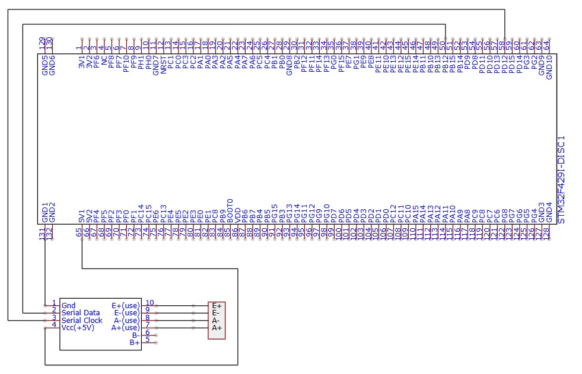
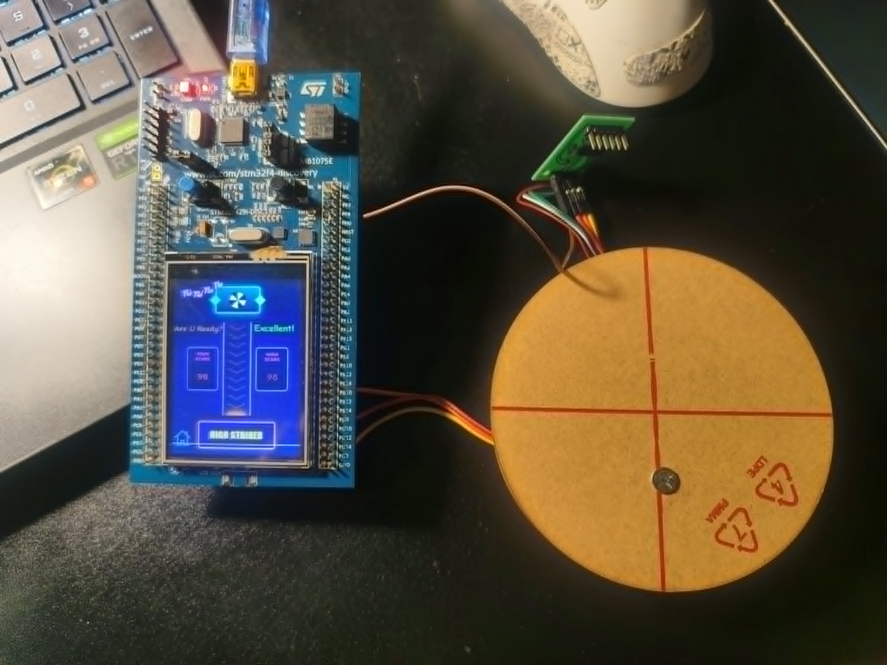

# Game High Striker với STM32F429I_DISCO_REV_D01

- Báo cáo bài tập lớn Hệ nhúng - IT4210
- Mã lớp: 168504
- Tên nhóm: nà ná na na

---

## Mục lục

- [Mô tả đề tài](#mô-tả-đề-tài)
- [Nhóm thực hiện](#nhóm-thực-hiện)
- [Phần cứng sử dụng](#phần-cứng-sử-dụng)
- [Phần mềm thực thi](#phần-mềm-thực-thi)
- [Sơ đồ schematic](#sơ-đồ-schematic)
- [Hình ảnh thực tế](#hình-ảnh-thực-tế)
- [Demo](#demo)
- [Đặc tả hàm](#đặc-tả-hàm)
  - [main.c](./Core/Src/main.c)
  - [score_interface.c](./Core/Src/score_interface.c)
  - [flash_storage.c](./Core/Src/flash_storage.c)
  - [hx711.c](./Core/Src/hx711.c)
  - [load_cell.c](./Core/Src/load_cell.c)

---

# Mô tả đề tài

- Xây dựng phần cứng và phần mềm mô phỏng trò chơi High Striker. Hệ thống sẽ đo lực tác động của người chơi lên cảm biến, sau đó hiển thị lên màn hình đồ họa trên kit STM32F429ZIT6. Ngoài ra hệ thống còn ghi nhận lại điểm cao nhất của người chơi (Highest Score).
- Các tính năng:
  - Hiển thị điểm hiện tại của người chơi
  - Lưu trữ và hiển thị điểm cao nhất
  - Reset lượt chơi bằng nút bấm user button
  - Giao diện đồ họa đẹp mắt

# Nhóm thực hiện

| STT | Họ tên | MSSV | Công việc |
| --- | --- | --- | --- |
| 1 | Vũ Tiến Chiến | 20235279 | Xử lý logic tổng thể (hàm main) |
| 2 | Nguyễn Hữu Trường | 20235447 | Cấu hình và xử lý giao tiếp phần cứng |
| 3 | Vũ Hữu Dương | 20235314 | Xử lý lưu trữ các điểm số |
| 4 | Trần Danh Chính | 20235280 | Thiết kế giao diện và xử lý hiển thị |
| 5 | Nguyễn Phúc Sơn | 20235417 | Thiết kế giao diện và xử lý hiển thị |

# Phần cứng sử dụng

| Tên thiết bị / Linh kiện | Mô tả & Chức năng |
| :--- | :--- |
| **STM32F429ZIT6** | Bo mạch điều khiển chính, xử lý logic, giao tiếp phần cứng |
| **HX711** | Khuếch đại tín hiệu từ loadcell, chuyển sang tín hiệu số gửi vào vi điều khiển |
| **Loadcell** | Cảm biến lực khi có tác động |
| **Dây nối** | Kết nối giữa các thiết bị |

# Phần mềm thực thi

| Công cụ / Phần mềm | Mô tả & Chức năng |
| :--- | :--- |
| **STM32CubeIDE** | Viết và quản lý code, hỗ trợ build, debug, nạp code vào MCU |
| **TouchGFX** | Thiết kế giao diện, hiệu ứng, hiển thị điểm, gen code tự động |
| **Firmware C/C++** | Xử lý giá trị đọc từ HX711, tính toán điểm và hiển thị lên màn hình |

# Sơ đồ schematic

### Bảng mô tả chi tiết ghép nối phần cứng

#### 1. Ghép nối giữa Module HX711 và STM32F429ZIT6

| Chân HX711 | Chân STM32F429 | Tín hiệu / Chức năng |
| :--- | :--- | :--- |
| **GND** | GND  | Nguồn đất chung |
| **Serial Data (DOUT)** | PB12  | Tín hiệu dữ liệu số (Data Out) |
| **Serial Clock (SCK)** | PD12  | Tín hiệu xung clock điều khiển (Clock Input) |
| **VCC (+5V)** | 5V / 5V1  | Nguồn cấp điện áp +5V cho HX711 |

#### 2. Ghép nối giữa Cảm biến Loadcell và Module HX711

| Màu dây Loadcell | Chân trên Module HX711 | Chức năng tín hiệu |
| :--- | :--- | :--- |
| **Đỏ** | E+ | Điện áp kích thích cực dương (Excitation +) |
| **Đen** | E- | Điện áp kích thích cực âm (Excitation -) |
| **Trắng** | A- | Tín hiệu vi sai kênh A âm (Signal A-) |
| **Xanh lá** | A+ | Tín hiệu vi sai kênh A dương (Signal A+) |

# Hình ảnh thực tế

# Đặc tả hàm

## [main.c](./Core/Src/main.c)

- `main()`: Điểm khởi đầu của chương trình. Thực hiện khởi tạo thư viện HAL, xung clock hệ thống, cấu hình các chân GPIO, CRC, I2C3, SPI5, FMC, LTDC, DMA2D và TouchGFX, sau đó khởi tạo 2 tác vụ (task) RTOS chính: `StartDefaultTask` và `TouchGFX_Task`.
- `SystemClock_Config()`: Cấu hình xung clock hệ thống cho STM32F429, bao gồm bộ PLL, các bus AHB/APB và chế độ Over-Drive.
- `MX_CRC_Init()`: Khởi tạo phần cứng tính toán CRC được sử dụng bởi hệ thống và framework TouchGFX.
- `MX_DMA2D_Init()`: Cấu hình bộ tăng tốc đồ họa DMA2D phục vụ hiển thị hình ảnh chuẩn màu RGB565.
- `MX_I2C3_Init()`: Khởi tạo giao tiếp I2C3 để làm việc với IC cảm ứng và các thiết bị ngoại vi I2C khác.
- `MX_SPI5_Init()`: Khởi tạo giao tiếp SPI5 để làm việc với màn hình LCD và đọc ID nhận diện phiên bản phần cứng của bo mạch.
- `MX_FMC_Init()`: Khởi tạo bộ điều khiển bộ nhớ ngoài FMC cho SDRAM, bao gồm cấu hình thời gian (timing) và chuỗi lệnh khởi tạo.
- `MX_LTDC_Init()`: Khởi tạo bộ điều khiển màn hình LCD (LTDC), các lớp hiển thị (layer) và trình điều khiển hiển thị ILI9341.
- `MX_GPIO_Init()`: Cấu hình các chân GPIO đóng vai trò làm tín hiệu đánh dấu hiệu năng (marker), chân chọn chip (Chip Select) cho SPI, và các chân điều khiển màn hình LCD.
- `BSP_SDRAM_Initialization_Sequence()`: Thực hiện chuỗi lệnh khởi tạo tiêu chuẩn để đưa bộ nhớ SDRAM ngoài vào trạng thái sẵn sàng hoạt động.
- `IOE_Init()`, `IOE_ITConfig()`, `IOE_Delay()`, `IOE_Write()`, `IOE_Read()`, `IOE_ReadMultiple()`: Các hàm lớp cầu nối giao tiếp I2C dành cho bộ điều khiển cảm ứng / bộ mở rộng cổng I/O.
- `LCD_IO_Init()`, `LCD_IO_WriteData()`, `LCD_IO_WriteReg()`, `LCD_IO_ReadData()`, `LCD_Delay()`: Các hàm lớp cầu nối giao tiếp SPI dành cho màn hình LCD ILI9341.
- `SPI5_Write()`, `SPI5_Read()`, `SPI5_Error()`: Các hàm xử lý giao tiếp bus SPI5 ở tầng thấp.
- `I2C3_WriteData()`, `I2C3_ReadData()`, `I2C3_ReadBuffer()`: Các hàm xử lý giao tiếp bus I2C3 ở tầng thấp.
- `StartDefaultTask()`: Luồng xử lý logic trò chơi chính. Thực hiện đọc điểm kỷ lục (High Score) từ bộ nhớ Flash, khởi tạo cảm biến lực HX711, theo dõi lực đập búa, xử lý sự kiện bấm nút B1 để bắt đầu lượt chơi mới, sau đó cập nhật trạng thái liên tục qua bộ giao tiếp `score_interface`.
- `HAL_TIM_PeriodElapsedCallback()`: Hàm callback định kỳ xử lý nhịp đếm hệ thống (tick) thông qua bộ định thời TIM6.
- `Error_Handler()`: Hàm xử lý lỗi hệ thống, được gọi khi có bất kỳ bước khởi tạo nào của thư viện HAL bị thất bại.

## [score_interface.c](./Core/Src/score_interface.c)

- `Score_Init(initialHighScore)`: Khởi tạo trạng thái trò chơi dùng chung giữa tầng Firmware (C) và tầng giao diện GUI (C++).
- `Score_GetDisplayData(outData)`: Sao chép toàn bộ dữ liệu hiển thị hiện tại ra biến đầu ra để TouchGFX đọc an toàn trong vùng găng (Critical Section).
- `Score_SetNewHit(level, percent)`: Ghi nhận một cú đập búa mới, kích hoạt cờ `isNewPeak` và tạm thời khóa không cho nhận cú đập tiếp theo.
- `Score_SetGameActive(active)`: Bật/tắt trạng thái trò chơi đang hoạt động khi ở Màn hình 2 (Screen2).
- `Score_IsGameActive()`: Trả về trạng thái cờ báo trò chơi có đang bật hay không.
- `Score_ResetHighScore()`: Xóa điểm kỷ lục trong bộ nhớ RAM và ghi giá trị 0 vào bộ nhớ Flash.
- `Score_ClearNewPeakFlag()`: Xóa cờ `isNewPeak` sau khi giao diện đồ họa (GUI) đã xử lý xong hiệu ứng hiển thị.
- `Score_GetHighScore()`: Đọc giá trị điểm kỷ lục hiện tại đang lưu trong bộ nhớ RAM.
- `Score_UpdateHighScore(newHighScore)`: Cập nhật giá trị điểm kỷ lục mới vào bộ nhớ RAM và ghi lưu vĩnh viễn xuống bộ nhớ Flash.
- `Score_RequestNewTurn()`: Đặt lại (Reset) điểm số lượt chơi hiện tại, bật cờ yêu cầu lượt chơi mới và sẵn sàng nhận cú đập tiếp theo.
- `Score_ClearResetScoreFlag()`: Xóa cờ yêu cầu đặt lại điểm sau khi giao diện GUI đã xử lý xong.
- `Score_IsReadyForHit()`: Trả về trạng thái cho biết hệ thống đã sẵn sàng nhận cú đập mới hay chưa.
- `Score_SetReadyForHit(ready)`: Bật/tắt trạng thái sẵn sàng nhận tín hiệu đập búa từ cảm biến lực.

## [flash_storage.c](./Core/Src/flash_storage.c)

- `Flash_ReadHighScore()`: Đọc điểm kỷ lục từ bộ nhớ Flash nội bộ tại sector đã định trước, đồng thời kiểm tra mã khóa xác thực (Magic Key) để đảm bảo dữ liệu đọc ra là hợp lệ.
- `Flash_SaveHighScore(highScore)`: Xóa sector bộ nhớ Flash tương ứng và ghi lại mã khóa xác thực cùng giá trị điểm kỷ lục mới.

## [hx711.c](./Core/Src/hx711.c)

- `HX711_InitDWT()`: Bật bộ đếm chu kỳ DWT (Data Watchpoint and Trace) để tạo độ trễ tính bằng microgiây ($\mu s$) một cách chính xác.
- `HX711_Init(hx, clk_port, clk_pin, dout_port, dout_pin, gain)`: Lưu cấu hình các chân GPIO và hệ số khuếch đại (Gain) của module HX711.
- `HX711_ReadRaw(hx, timeout_ms)`: Chờ chân tín hiệu DOUT sẵn sàng, đọc chuỗi 24-bit dữ liệu bằng phương pháp Bit-bang, mở rộng dấu sang kiểu `int32_t`, và trả về mã lỗi nếu quá thời gian chờ (timeout).

## [load_cell.c](./Core/Src/load_cell.c)

- `LoadCell_Init(lc, clk_port, clk_pin, dout_port, dout_pin)`: Khởi tạo bộ đếm DWT, cấu hình các chân GPIO cho HX711 và thiết lập trạng thái ban đầu cho bộ lọc tín hiệu lực.
- `LoadCell_Tare(lc, sample_count)`: Đo nhiều mẫu tín hiệu khi chưa có lực tác động để tính giá trị lệch chuẩn ban đầu (Offset/Taring).
- `LoadCell_SetScale(lc, scale)`: Thiết lập hệ số tỉ lệ quy đổi từ giá trị thô (Raw) sang giá trị lực thực tế.
- `LoadCell_Process(lc, out_peak_force)`: Đọc giá trị lực hiện tại, phát hiện cú đập dựa trên ngưỡng lực và tốc độ tăng lực, sau đó ghi nhận giá trị lực đỉnh trong khoảng thời gian đo.
- `Force_To_Percent(peak_force)`: Chuyển đổi giá trị lực đỉnh đo được sang thang điểm phần trăm ($0 \dots 100\%$).
- `Percent_To_Level(percent)`: Chuyển đổi điểm phần trăm sang cấp độ lực từ $0 \dots 10$ để chọn khung hình hiển thị đồ họa tương ứng.
